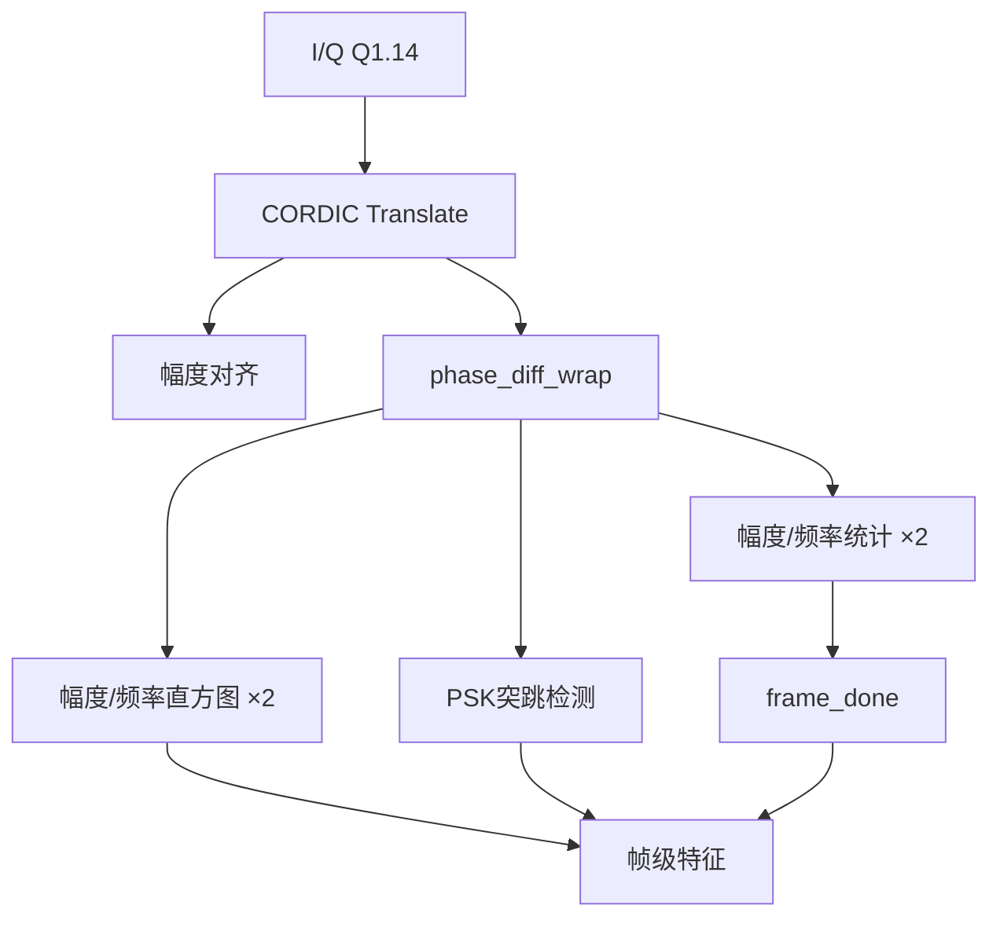
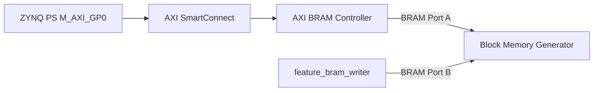

# ZYNQ-7020 解调池模块连接与管理说明

## 1. 文档目的

本工程实现第二级“绝对并行特征提取（解调池层）”。本文件说明：

- 每个 Verilog 模块完成什么功能；
- 模块之间如何连接；
- 为什么采用这种连接方式；
- 时钟、复位、有效信号、帧边界和 BRAM 快照如何统一管理；
- Vivado 2018.3 Block Design 中的 IP 应如何连接；
- PS 如何安全读取 PL 产生的一帧特征。

工程全部用户代码均为 `.v` 文件，使用 Verilog-2001，不使用 SystemVerilog。

## 2. 系统在上下级中的位置


上一级向本级提供 16 位 I/Q 基带样本。本级把每 `2^LGN` 个有效瞬时特征组织成一帧，默认 `LGN=13`，即每帧 8192 个有效样本。本级不直接完成最终调制类型分类，而是把稳定的统计特征交给 PS 或后续分类模块。

## 3. 文件结构与职责

| 文件 | 类型 | 主要职责 |
|-----|------|---------|
| `rtl/demod_pool_core.v` | 顶层 RTL | 连接 CORDIC、相位差、统计、直方图和 PSK 检测支路 |
| `rtl/phase_diff_wrap.v` | RTL | 相邻相位求差并消除正负 π 边界跳变 |
| `rtl/running_stats16.v` | RTL | 流水线计算均值分子和方差分子 |
| `rtl/hist16_snapshot.v` | RTL | 16 档实时直方图及完整窗口快照 |
| `rtl/psk_spike_detector.v` | RTL | 统计可信的大相位突跳并产生 PSK 标志 |
| `rtl/feature_bram_writer.v` | 系统接口 RTL | 把一帧特征按固定内存映射写入 BRAM Port B |
| `sim/tb_phase_diff_wrap.v` | Testbench | 验证正负 π 边界包裹 |
| `sim/tb_running_stats16.v` | Testbench | 验证流水线均值/方差计算及完成脉冲 |
| `sim/tb_feature_bram_writer.v` | Testbench | 验证 BRAM 地址、数据映射和提交顺序 |
| `sim/tb_demod_pool_core.v` | Testbench | 使用真实 CORDIC 验证 CW、AM、FM 和 2PSK |
| `sim/cordic_translate_0_stub.v` | 仿真占位 | 仅用于无真实 IP 时做语法检查，不验证算法 |

## 4. demod_pool_core 内部总体框架



CORDIC 后面的三个特征分支同时处理同一条 `feature_valid` 数据流，因此称为“绝对并行”：统计、直方图和 PSK 检测不会逐个串行执行，也不会互相等待。

这种结构的优点是：

1. 输入吞吐率由最前端 CORDIC 决定，后级支路可每拍并行更新；
2. 各特征模块相互独立，便于单独仿真、修改和资源评估；
3. 所有支路使用同一窗口计数条件，帧边界一致；
4. 新增特征时只需并联新支路，不必破坏原有数据通道。

## 5. 上一级与 demod_pool_core 的连接

| 上一级信号 | demod_pool_core | 位宽 | 说明 |
|---|---|---:|---|
| I 数据 | `s_i` | 16 | Q1.14 有符号同相分量 |
| Q 数据 | `s_q` | 16 | Q1.14 有符号正交分量 |
| 数据有效 | `s_valid` | 1 | I/Q 在当前周期有效 |
| 接收允许 | `s_ready` | 1 | CORDIC 能否接受当前数据 |

一次输入传输只在下面条件成立时发生：

```verilog
s_valid && s_ready
```

上一级在 `s_valid=1` 且 `s_ready=0` 时必须保持 `s_i`、`s_q` 和 `s_valid` 不变。采用 ready/valid 的原因是 CORDIC 属于 AXI4-Stream 风格 IP，显式握手可以避免下游暂停时丢样本。

CORDIC 输入数据必须按下面顺序打包：

```verilog
cordic_s_tdata = {s_q, s_i};
```

低 16 位为 X=I，高 16 位为 Y=Q。顺序接反会导致相位和旋转方向错误。

## 6. CORDIC 与相位差模块

CORDIC 输出 48 位：

| 位段 | 含义 |
|---|---|
| `[23:0]` | 24 位幅度 `mag_raw` |
| `[47:24]` | 24 位 Scaled Radians 相位 `phase_raw` |

连接关系：

```text
cordic_translate_0/m_axis_dout_tdata[47:24]
    → phase_diff_wrap/phase_in

cordic_translate_0/m_axis_dout_tvalid
    → phase_diff_wrap/in_valid
```

`phase_diff_wrap`只在 `in_valid=1` 时保存上一相位。第一个有效相位只能建立历史值，无法形成相位差，因此第一个输出的 `out_valid=0`。

模块将原始相位差包裹到约 `[-π,+π)`：

- 差值大于等于 `+π` 时减去 `2π`；
- 差值小于 `-π` 时加上 `2π`。

这样可以避免相位从 `+0.9π` 跳到 `-0.9π` 时错误得到 `-1.8π`，正确结果应为约 `+0.2π`。

## 7. 瞬时特征的统一有效信号

顶层输出：

```verilog
mag_out       = mag_z1;
dphi_out      = dphi_raw;
feature_valid = dphi_valid;
```

所有统计支路都以 `feature_valid`，即内部的 `dphi_valid`，作为唯一计数使能。这样做可以保证：

- CORDIC 的流水线空拍不会被统计；
- 第一个没有前驱相位的样本不会被统计；
- 幅度统计、频率统计、两个直方图和 PSK 检测使用相同样本数量。

`mag_z1`用于对幅度增加一级寄存，使幅度与相位差时序相匹配。

## 8. running_stats16 的连接与流水线管理

`demod_pool_core`例化两个完全相同的统计模块：

```text
mag_stat_x  → u_mag_stats  → mean_mag_num、var_mag_num
freq_stat_x → u_freq_stats → mean_freq_num、var_freq_num
```

两个实例都连接：

```text
in_valid = dphi_valid
LGN      = 顶层LGN
```

因此两个统计窗口同步开始、同步结束，并具有相同流水线延迟。

统计公式为：

```text
mean_num = sum(x)
var_num  = N×sum(x²) - sum(x)²
```

除法放在 PS 端完成：

```text
mean     = mean_num / N
variance = var_num / N²
```

100 MHz 时序优化后的结算过程为：

| 阶段 | 运算 |
|---|---|
| 正常累加 | 每个 `in_valid` 更新 `sum` 和 `sumsq` |
| 阶段0 | 捕获完整窗口的 `final_sum`、`final_sumsq` |
| 阶段1 | 并行计算 `final_sum²`、`N×final_sumsq` |
| 阶段2 | 64 位减法并更新输出、拉高 `window_done` |

拆分流水线是为了消除原来 `dphi → 平方 → 累加 → 64位减法 → var_num` 的单周期长路径。新窗口累加与上一窗口结算可重叠，因此吞吐率仍为每拍一个有效样本。

## 9. hist16_snapshot 的连接与双数组管理

顶层例化两个直方图：

```text
mag_bin  → u_hist_mag
freq_bin → u_hist_freq
```

每个模块内部均包含：

- `live[0:15]`：当前窗口实时累加；
- `snap[0:15]`：上一完整窗口的只读快照。

窗口最后一个样本到来时，模块把 `live`复制到 `snap`，同时把最后一个样本计入对应 bin，然后清空 `live`。这种“实时区 + 快照区”管理方式允许 writer 读取上一完整窗口时，下一窗口继续统计。

幅度直方图：

```verilog
mag_bin = mag_z1[22:19];
bin_enable = 1'b1;
```

频率直方图：

```text
freq_bin = saturate((dphi_raw >>> 15) + 8, 0, 15)
bin_enable = (mag_z1 > MAG_GATE)
```

低幅度样本仍推进固定窗口计数，但不增加频率 bin。原因是信号接近零时相位没有可靠意义。

## 10. psk_spike_detector 的连接

连接关系：

```text
dphi_raw                → dphi
mag_z1 > MAG_GATE       → mag_good
dphi_valid              → in_valid
```

模块计算 `abs(dphi)`，当幅度可信且绝对相位差超过 `SPIKE_TH` 时计为一次突跳。一帧中的突跳数达到 `MIN_SPIKES` 后置 `psk_flag=1`。

幅度门控非常重要。若不门控，ASK 信号包络接近零时的随机相位可能产生大量假突跳，造成 ASK 被误判成 PSK。

## 11. frame_done 的选择

顶层使用：

```verilog
frame_done = mag_stats_done;
```

原因是流水线统计支路是当前结算延迟最长的支路。`mag_stats_done`出现时：

- 幅度和频率统计结果已更新；
- 两组直方图快照早已稳定；
- PSK突跳统计结果已稳定。

因此 writer 在 `frame_done` 后读取所有支路，不会读到不同窗口或尚未完成的结果。`freq_stats_done`应与 `mag_stats_done`同周期，可在仿真中作为一致性检查，但无需再参与顶层触发。

## 12. demod_pool_core 与 feature_bram_writer 的连接

### 12.1 标量特征

| demod_pool_core | feature_bram_writer |
|---|---|
| `frame_done` | `frame_done` |
| `var_mag_num[63:0]` | `var_mag_num[63:0]` |
| `var_freq_num[63:0]` | `var_freq_num[63:0]` |
| `mean_mag_num[31:0]` | `mean_mag_num[31:0]` |
| `mean_freq_num[31:0]` | `mean_freq_num[31:0]` |
| `psk_spike_count[31:0]` | `psk_spike_count[31:0]` |
| `psk_flag` | `psk_flag` |

### 12.2 直方图读取回路

| 信号方向 | 连接 |
|---|---|
| writer → core | `hist_mag_rd_addr` → `hist_mag_rd_addr` |
| core → writer | `hist_mag_rd_data` → `hist_mag_rd_data` |
| writer → core | `hist_freq_rd_addr` → `hist_freq_rd_addr` |
| core → writer | `hist_freq_rd_data` → `hist_freq_rd_data` |

writer写到字8～23时依次给出幅度直方图地址0～15，写到字24～39时依次给出频率直方图地址0～15。直方图采用组合读，因此地址和对应数据可在同一写周期使用。

## 13. BRAM 双端口架构



端口分工：

- Port A 由 AXI BRAM Controller 独占，供 PS 读写；
- Port B 由 `feature_bram_writer`独占，供 PL 写入特征；
- 两个端口访问同一存储空间。

选择双口 BRAM 的原因是 PS 读取和 PL 写入无需经过同一个仲裁状态机，接口简单且延迟确定。

### 13.1 BMG配置

| 项目 | 设置 |
|---|---|
| Mode | `BRAM Controller` |
| Memory Type | `True Dual Port RAM` |
| Data Width A/B | `32` |
| Byte Write Enable | 开启，Byte Size=8 |
| Common Clock | 同一FCLK时建议开启 |
| ECC | No ECC |
| Output Register | 关闭，与Controller Read Latency=1匹配 |

### 13.2 AXI BRAM Controller配置

| 项目 | 设置 |
|---|---|
| AXI Protocol | AXI4 |
| Data Width | 32 |
| BRAM Instance | External |
| Number of BRAM Interfaces | 1 |
| Read Latency | 1 |
| ECC | No |

Controller只使用一个BRAM接口，才能把BMG的另一个端口完整保留给writer。

### 13.3 writer到BMG Port B

| feature_bram_writer | BMG Port B |
|---|---|
| `bram_addr[31:0]` | `addrb[31:0]` |
| `bram_wdata[31:0]` | `dinb[31:0]` |
| `bram_en` | `enb` |
| `bram_we[3:0]` | `web[3:0]` |
| `aclk`对应时钟 | `clkb` |
| 高有效系统复位 | `rstb` |

`doutb`无需连接，因为writer不从BRAM Port B读数据。

## 14. BRAM地址与内存映射

BMG的BRAM Controller接口使用字节地址，每个32位字占4字节：

```verilog
bram_addr = {24'd0, word_index, 2'b00};
```

| 字序号 | 字节偏移 | 内容 |
|---:|---:|---|
| 0 | `0x00` | `sequence`，完整快照提交序号 |
| 1 | `0x04` | `var_mag_num[31:0]` |
| 2 | `0x08` | `var_mag_num[63:32]` |
| 3 | `0x0C` | `var_freq_num[31:0]` |
| 4 | `0x10` | `var_freq_num[63:32]` |
| 5 | `0x14` | `mean_mag_num` |
| 6 | `0x18` | `mean_freq_num` |
| 7 | `0x1C` | `{psk_flag, psk_spike_count[30:0]}` |
| 8～23 | `0x20～0x5C` | 幅度直方图bin0～15 |
| 24～39 | `0x60～0x9C` | 频率直方图bin0～15 |

地址1～39先写，地址0最后写。`sequence`只在完整特征已经进入BRAM后变化。

PS端读取第n个字：

```c
value = Xil_In32(FEATURE_BRAM_BASE + 4U * n);
```

推荐PS流程：

1. 保存上次处理的 `last_sequence`；
2. 轮询字0，直到值与 `last_sequence`不同；
3. 读取字1～39；
4. 再次读取字0；若序号发生变化则重新读取本帧；
5. 保存新的序号并执行分类。

在默认1 MHz样本率、8192样本窗口下，两帧间隔约8.192 ms，而PL写入只需约40个PL时钟，PS有充足读取时间。

## 15. 时钟与复位管理

所有自定义RTL、SmartConnect、AXI BRAM Controller和BMG Port B使用同一个 `FCLK_CLK0`，避免引入跨时钟域问题。

```text
FCLK_CLK0
├── demod_pool_core/aclk
├── feature_bram_writer/aclk
├── AXI SmartConnect/aclk
├── AXI BRAM Controller/s_axi_aclk
├── PS/M_AXI_GP0_ACLK
├── BMG/clkb
└── Processor System Reset/slowest_sync_clk
```

复位极性必须区分：

| 复位输出 | 极性 | 连接对象 |
|---|---|---|
| `peripheral_aresetn` | 低有效 | 两个自定义RTL的`aresetn`、AXI Controller复位 |
| `interconnect_aresetn` | 低有效 | SmartConnect复位 |
| `peripheral_reset` | 高有效 | BMG的`rstb` |

Processor System Reset还应满足：

```text
FCLK_RESET0_N → ext_reset_in（配置成低有效）
常量1          → dcm_locked
未用aux复位    → 固定在非激活电平
常量0          → mb_debug_sys_rst
```

禁止把低有效 `peripheral_aresetn`直接接到高有效 `rstb`，否则BRAM复位逻辑会反相。

## 16. Vivado工程管理建议

### 16.1 综合源

加入 `Design Sources`：

```text
rtl/demod_pool_core.v
rtl/phase_diff_wrap.v
rtl/running_stats16.v
rtl/hist16_snapshot.v
rtl/psk_spike_detector.v
rtl/feature_bram_writer.v
真实cordic_translate_0.xci
```

### 16.2 仿真源

按测试目标分别设置顶层：

- `tb_phase_diff_wrap`：不需要任何Xilinx IP；
- `tb_feature_bram_writer`：不需要任何Xilinx IP；
- `tb_demod_pool_core`：必须使用真实CORDIC仿真模型。

`cordic_translate_0_stub.v`不能与真实CORDIC同时编译。

### 16.3 自定义IP更新

如果把 `demod_pool_core`或writer封装为自定义IP，修改RTL后必须：

1. 在原IP工程中更新`.v`源文件；
2. Re-Package IP；
3. Refresh IP Catalog；
4. Upgrade BD中的IP实例；
5. 重新Generate Output Products；
6. Reset并重新运行Synthesis和Implementation。

只修改普通工程目录中的副本而不重新封装，BD可能仍综合旧版本。

## 17. 验证顺序

推荐按从小到大的顺序验证：

1. 仿真 `phase_diff_wrap`，确认跨±π包裹正确；
2. 仿真 `running_stats16`，确认流水线结果和`window_done`正确；
3. 仿真 `feature_bram_writer`，确认地址、数据和sequence提交正确；
4. 使用真实CORDIC仿真 `demod_pool_core`；
5. Validate Design；
6. 综合后检查资源利用率；
7. 实现后确认 `WNS >= 0`、`TNS = 0`、`Failing Endpoints = 0`；
8. 上板后用ILA观察 `s_valid/s_ready`、`feature_valid`、`frame_done`和BRAM写接口；
9. PS轮询sequence并打印字1～39，核对软硬件内存映射。

## 18. 常见错误

| 现象 | 常见原因 |
|---|---|
| CORDIC输入正常但相位方向错误 | `{I,Q}`打包顺序写反，应为`{Q,I}` |
| 第一帧样本数少1 | 忘记相位差第一个样本没有前驱，或窗口最后样本未计入 |
| 频率特征出现大量尖峰 | 没有用幅度门限屏蔽低幅度随机相位 |
| PS读出的字位置错乱 | writer输出了字地址而不是字节地址，缺少`<<2` |
| PS偶尔读到半帧 | 未等待字0的sequence更新就读取特征 |
| 100MHz Setup违例 | 仍使用未流水化的`running_stats16.v` |
| 修改RTL后结果没变化 | 自定义IP未重新Package和Upgrade |
| BRAM一直复位或数据为0 | `aresetn`与`rstb`复位极性接反 |
| 仿真输出幅相始终为0 | 错把CORDIC stub用于算法仿真 |

## 19. 最终接口边界

本级对其他成员承诺的接口可以概括为：

- 输入：16位Q1.14的I/Q、`s_valid`；
- 反压：`s_ready`；
- 实时输出：24位幅度、24位相位差、`feature_valid`；
- 帧级输出：统计量、直方图、PSK特征、`frame_done`；
- 系统输出：通过双口BRAM固定映射向PS提交40个32位字；
- 时钟：统一使用PL `FCLK_CLK0`；
- 复位：用户RTL统一低有效 `aresetn`。

只要上下级遵守握手、定点格式、窗口和BRAM地址约定，就可以独立开发并在最终BD中直接集成。
